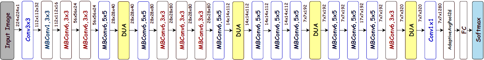

# EDANet
Web-based efficient dual attention networks to detect COVID-19 from X-ray images

### Abstract 
Rapid and accurate detection of COVID-19 is a crucial step to control the virus. For this purpose, the authors designed a web-based COVID-19 detector using efficient dual attention networks, called ‘EDANet’. The EDANet architecture is based on inverted residual structures to reduce the model complexity and dual attention mechanism with position and channel attention blocks to enhance the discriminant features from the different layers of the network. Although the EDANet has only 4.1 million parameters, the experimental results demonstrate that it achieves the state-of-the-art results on the COVIDx data set in terms of accuracy and sensitivity of 96 and 94%. The web application is available at the following link [https://covid19detector-cxr.herokuapp.com/](). 

### Introduction
This repository includes the code for reproducing the following paper which was published in Electronics Letters on 21 October 2020.

<center></img></center>

If you use this code, please consider citing:

```
@article{sarker2020web,
  title={Web-based efficient dual attention networks to detect COVID-19 from X-ray images},
  author={Sarker, Md Mostafa Kamal and Makhlouf, Yasmine and Banu, Syeda Furruka and Chambon, Sylvie and Radeva, Petia and Puig, Domenec},
  journal={Electronics Letters},
  year={2020},
  publisher={IET}
}

```
